# Loan Eligibility & Lead Management System

A complete Loan Eligibility & Lead Management System developed using Laravel 12, MySQL, Bootstrap 5, and REST API.

## Features

- Loan Application Form
- Credit Score Generation
- BRE (Business Rule Engine)
- Loan Eligibility Result
- REST API
- Admin Login
- Dashboard Analytics
- Lead Management
- Search Leads
- View Lead
- Edit Lead
- Delete Lead
- MySQL Database

---

## Technology Stack

- Laravel 12
- PHP 8.2
- MySQL
- Bootstrap 5
- HTML
- CSS
- JavaScript
- REST API
- Git & GitHub

---

## Installation

```bash
git clone https://github.com/Vickychaubey73/loan-management-system.git

cd loan-management

composer install

cp .env.example .env

php artisan key:generate

php artisan migrate

php artisan serve
```

---

## API Endpoint

### Create Lead

```
POST /api/leads
```

Sample JSON

```json
{
    "full_name":"Vicky Chaubey",
    "mobile":"9999999911",
    "email":"vicky@gmail.com",
    "dob":"2001-01-01",
    "city":"Jaipur",
    "pincode":"303002",
    "loan_type":"Home Loan",
    "employment_type":"Salaried",
    "monthly_income":50000,
    "loan_amount":300000,
    "property_value":700000
}
```

---

## Screenshots

### Home Page

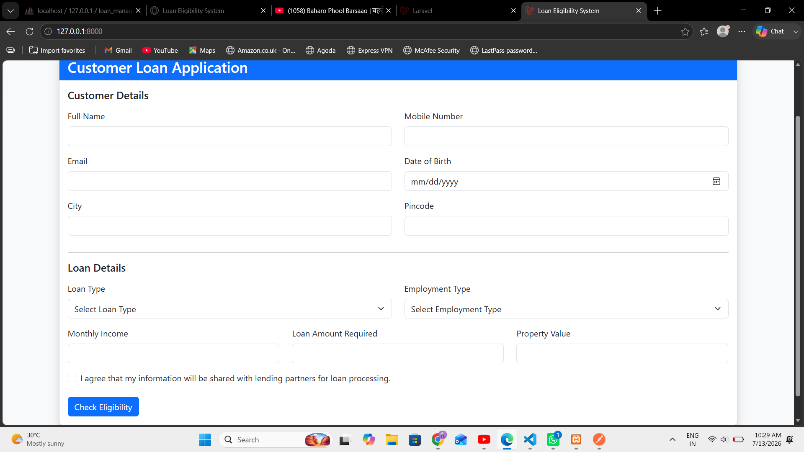

---

### Loan Result

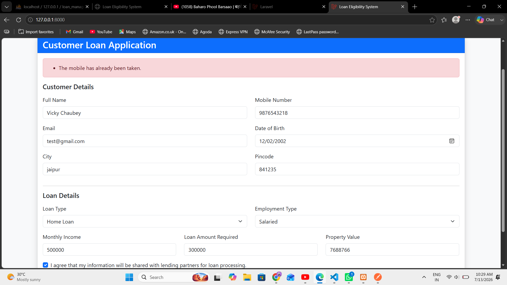

---

### Loan Result 2

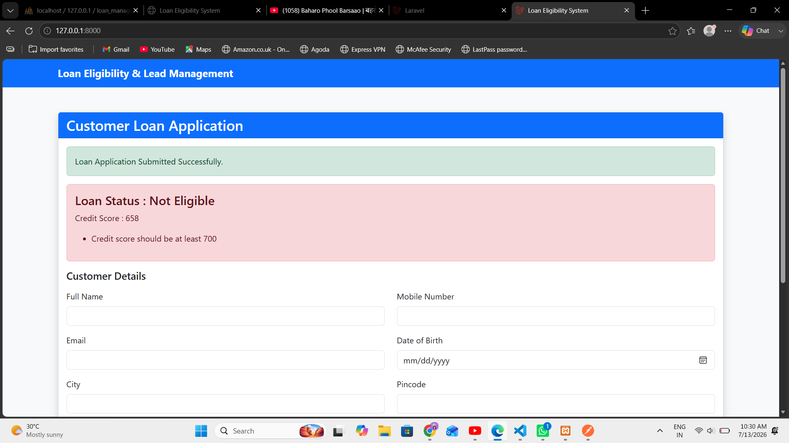

---

### Admin Login

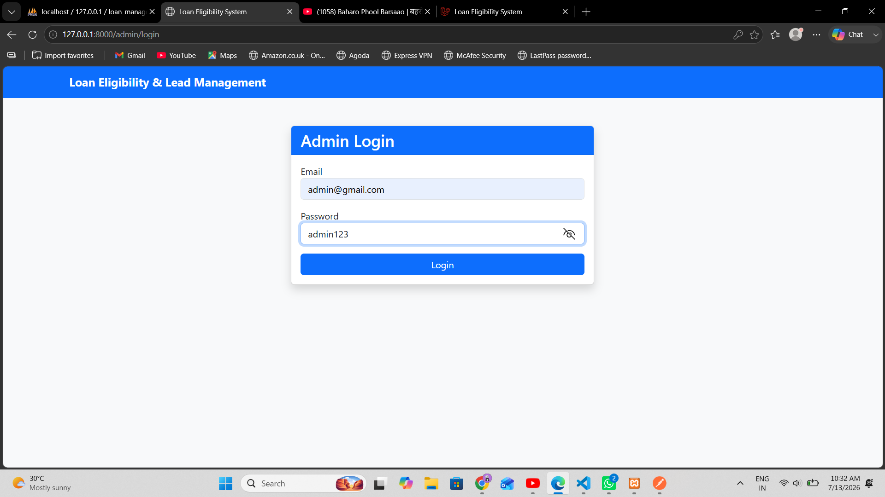

---

### Dashboard

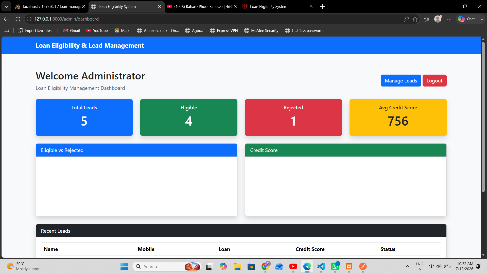

---

### Dashboard Analytics

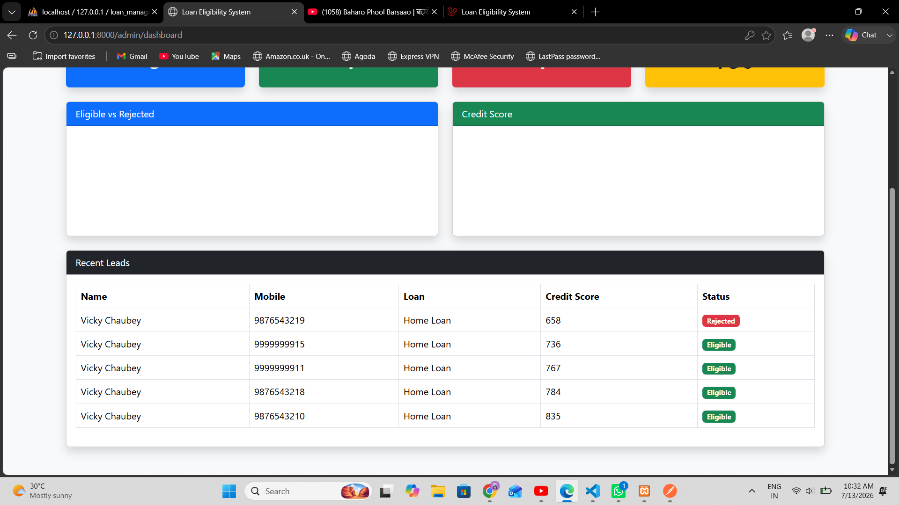

---

### Dashboard

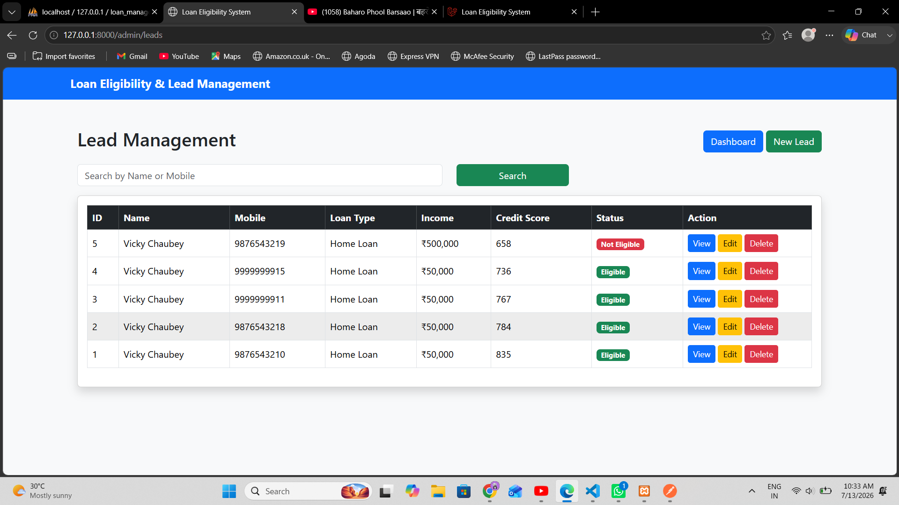

---

### Lead Management

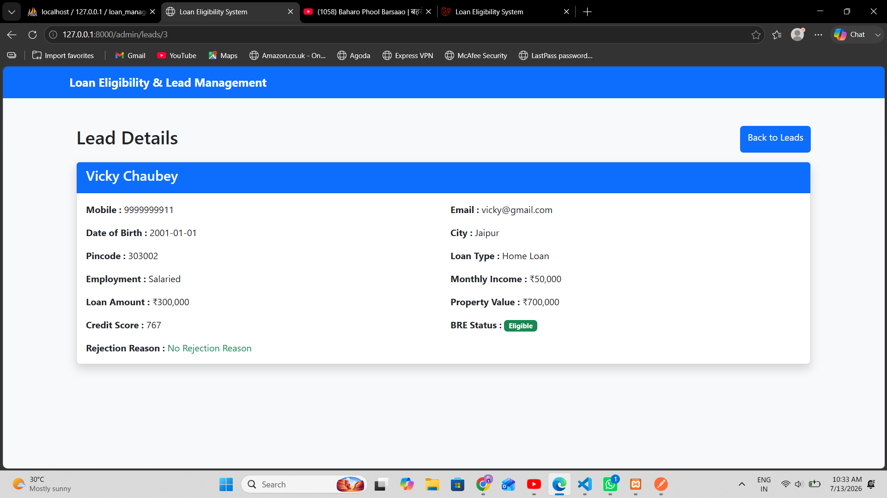

---

### Lead Details

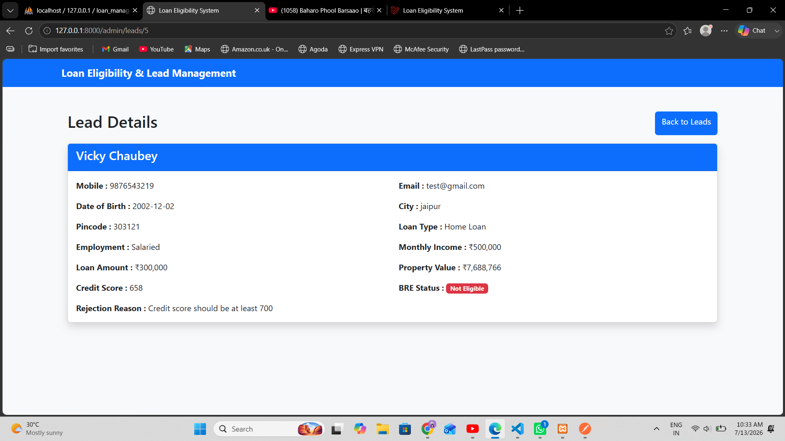

---

### Edit Lead

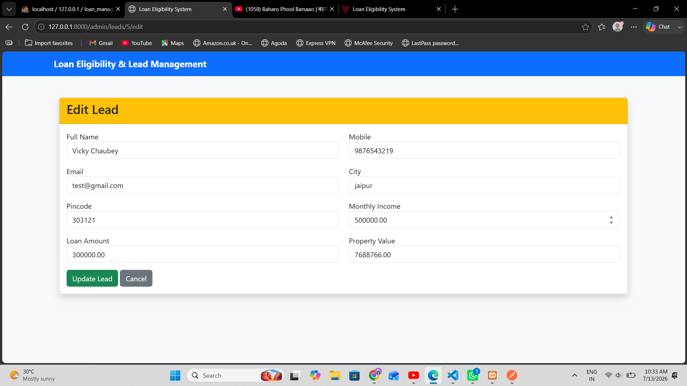

---

### Database Structure

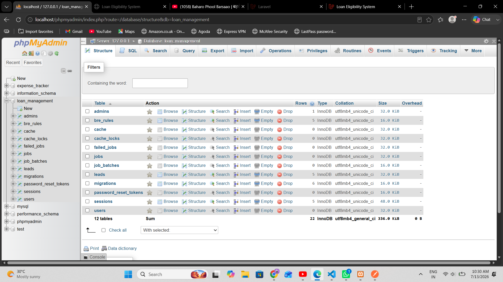

---

### Database

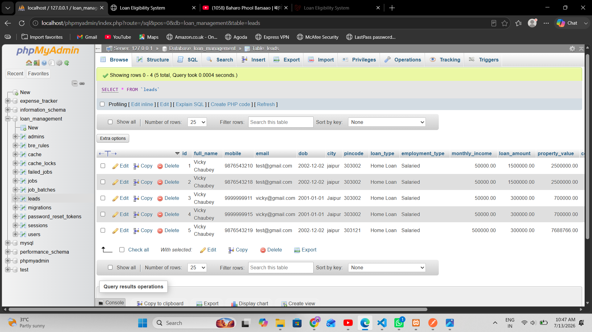

### REST API (Postman)

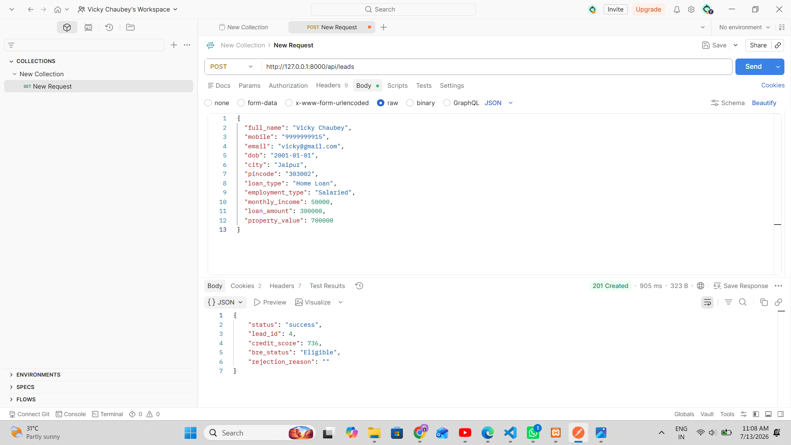

---

## Author

**Vicky Chaubey**

GitHub

https://github.com/Vickychaubey73
